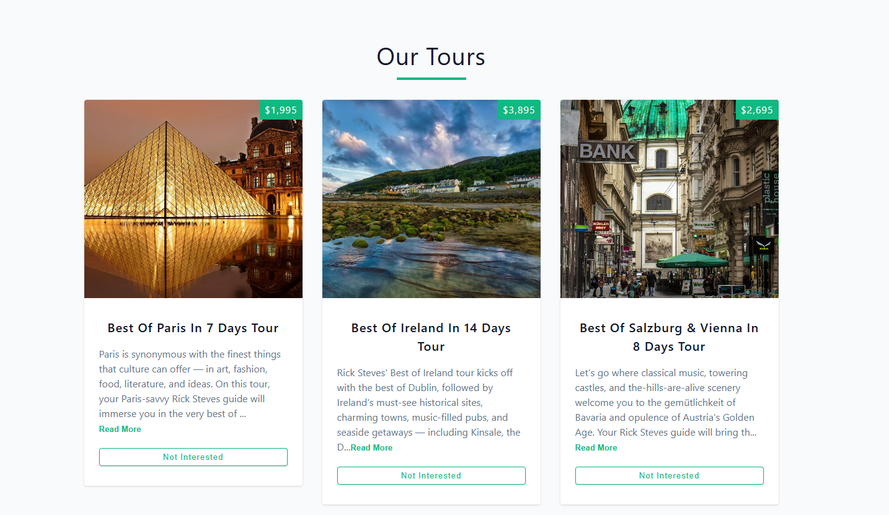

# Tours App

A React application that demonstrates core React concepts including **state management**, **side effects**, and **conditional rendering** while fetching and displaying tour data.



## Project Overview

This project is a practical learning exercise that applies fundamental React hooks and patterns to build an interactive tours listing application. Users can browse tours, expand descriptions, remove tours from the list, and refetch the entire dataset.

## Key Learning Concepts

### 1. **useState Hook** - State Management

- **`isLoading`**: Tracks the loading state while fetching data from the API
- **`tours`**: Manages the array of tour objects displayed in the UI
- **`readMore`**: Toggles the expanded/collapsed state of tour descriptions within individual Tour components

### 2. **useEffect Hook** - Side Effects

- Automatically fetches tour data when the App component mounts
- Dependency array is empty (`[]`), ensuring the effect runs only once on initial load
- Handles asynchronous data fetching without blocking the UI

### 3. **Conditional Rendering** - UI Logic

- **Loading State**: Displays a Loading component while data is being fetched
- **Empty State**: Shows a message and refresh button when all tours are removed
- **Content State**: Renders the Tours component with full tour data
- **Read More Toggle**: Shows truncated text (200 characters) by default, full text when expanded

## Features

### Data Fetching

- Fetches tour data from the [Course API](https://www.course-api.com/react-tours-project)
- Uses the native Fetch API for HTTP requests
- Error handling with try-catch blocks

### Tour Display

- Maps over the tours array and renders individual Tour components
- Each tour displays an image, name, price, and description
- Props are passed down to child components for flexible, reusable design

### Remove Tour

- "Not Interested" button removes a tour from the list
- Updates the parent Tours component state using the `removeTour` callback
- Filtered array is stored back in state

### Read More/Show Less

- Toggles between showing abbreviated (200 chars) and full descriptions
- Uses `useState` in the Tour component to manage individual tour state
- Conditional rendering determines which button text and content to display

### Refresh Functionality

- "Refresh" button re-fetches all tours from the API
- Sets loading state during the refresh process
- Restores the full dataset

## Component Structure

```
App.jsx
├── Loading.jsx
└── Tours.jsx
    └── Tour.jsx (multiple instances)
```

### **App.jsx** (Main Component)

- Manages global state: `isLoading` and `tours`
- Handles all data fetching logic
- Implements conditional rendering for different UI states
- Provides callbacks to child components

### **Tours.jsx**

- Receives tours array and removeTour callback as props
- Maps over tours and renders Tour components
- Displays the "Our Tours" section title

### **Tour.jsx** (Individual Tour)

- Receives tour data and removeTour callback as props
- Manages its own `readMore` state for description expansion
- Renders tour card with image, price, name, and description
- Two action buttons: "read more"/"Show Less" and "Not Interested"

### **Loading.jsx**

- Simple, reusable loading indicator component
- Displays while data is being fetched

## Technologies Used

- **React** - UI library
- **Vite** - Build tool and dev server
- **JavaScript ES6+** - Modern JavaScript features
- **Fetch API** - Data fetching

## Getting Started

1. Install dependencies:

   ```bash
   npm install
   ```

2. Start the development server:

   ```bash
   npm run dev
   ```

3. Open the application in your browser at the URL provided by Vite

## Design Reference

[View Figma Design](https://www.figma.com/file/OnLoM3AzBFaHzSc2iolJS0/Tours?node-id=0%3A1&t=wiRXOlTLN5ehekYI-1)
